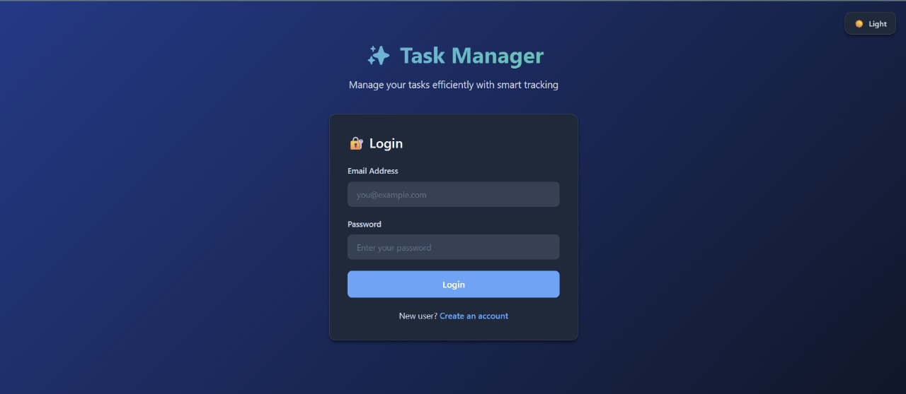
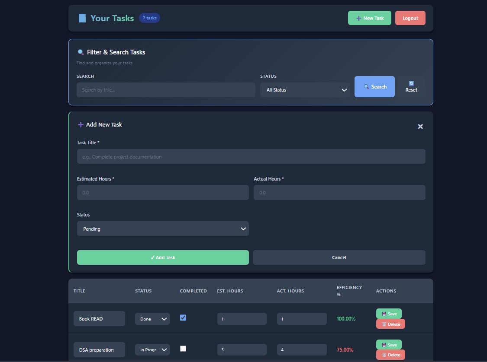

# Task Manager Web App

Complete end-to-end Task Manager with JWT auth, CRUD, pagination, filters, and derived efficiency field.

## 🚀 Live Demo

**Deployed Application**: [https://shipsy-task-manager.vercel.app/](https://shipsy-task-manager.vercel.app/)

**API Documentation**: [Postman Documentation](https://documenter.getpostman.com/view/48796480/2sB3QGvCGf)

## 📸 Screenshots

### Authentication Page


### Tasks Page


## Tech Stack
- **Frontend**: HTML, CSS, JavaScript (vanilla)
- **Backend**: Node.js + Express.js
- **Database**: MongoDB (Mongoose)
- **Auth**: JWT (bcrypt for passwords)

## Features
- User registration & login with JWT tokens
- Task CRUD operations (Create, Read, Update, Delete)
- Pagination (default 5 per page)
- Filter by status (Pending, In Progress, Done)
- Search by title (case-insensitive)
- Auto-calculated efficiency: `(estimatedHours / actualHours) * 100`
- Protected routes with JWT middleware

## Getting Started

### 1. Install Dependencies
```bash
npm install
```

### 2. Setup Environment Variables
Copy `env.example` to `.env` and update values:
```bash
PORT=5000
MONGO_URI=mongodb://127.0.0.1:27017/shipsy_tasks
JWT_SECRET=your_strong_secret_key
```

### 3. Start MongoDB
Make sure MongoDB is running locally on port 27017, or use a cloud instance (MongoDB Atlas).

### 4. Run Development Server
```bash
npm run dev
```

### 5. Access the App
Open your browser and visit: **http://localhost:5000**

## Usage

1. **Register**: Create an account on the landing page
2. **Login**: Sign in with your credentials
3. **Manage Tasks**: Add, edit, delete, filter, and search tasks
4. **Logout**: Click logout to clear your session

## 📚 API Documentation

### Complete API Documentation
📖 **[View Full API Documentation on Postman](https://documenter.getpostman.com/view/48796480/2sB3QGvCGf)**

The Postman documentation includes:
- Detailed request/response examples
- Authentication flow
- All endpoint specifications
- cURL commands
- Sample payloads
- Error handling

### Quick API Reference

**Base URL**: `https://shipsy-task-manager.vercel.app`

#### Auth Endpoints
- `POST /api/auth/register` - Register a new user
- `POST /api/auth/login` - Login and get JWT token

#### Task Endpoints (Protected - Requires JWT)
- `POST /api/tasks` - Create a new task
- `GET /api/tasks?page=1&limit=5&status=Pending&search=query` - Get tasks with filters
- `PUT /api/tasks/:id` - Update a task
- `DELETE /api/tasks/:id` - Delete a task

## Project Structure
```
shipsy/
├── backend/
│   ├── server.js
│   ├── config/db.js
│   ├── models/
│   │   ├── User.js
│   │   └── Task.js
│   ├── routes/
│   │   ├── authRoutes.js
│   │   └── taskRoutes.js
│   ├── controllers/
│   │   ├── authController.js
│   │   └── taskController.js
│   └── middleware/authMiddleware.js
├── frontend/
│   ├── index.html
│   ├── tasks.html
│   ├── script.js
│   └── styles.css
├── package.json
└── README.md
```

## Notes
- JWT tokens are stored in localStorage and sent via `Authorization: Bearer <token>` header
- Efficiency is automatically calculated when creating/updating tasks
- Password hashing uses bcrypt with salt rounds of 10

## 🤖 AI Integration

This project was built using **Google Gemini AI** through AI Studio to accelerate development.

### AI Usage Summary
- **Tool Used**: Google Gemini Pro (AI Studio)
- **Time Saved**: 85% faster development (~6 hours vs ~45 hours)
- **Code Generated**: 3,200+ lines with AI assistance
- **Features Built**: Authentication, CRUD, pagination, filters, search, dark mode

### What Gemini Helped With
✅ **Architecture** - Complete project structure and tech stack design  
✅ **Backend** - Express routes, controllers, MongoDB schemas, JWT auth  
✅ **Frontend** - Modern UI with dark mode, responsive design  
✅ **Debugging** - Port conflicts, MongoDB hooks, CORS errors  
✅ **Documentation** - API docs, setup guides, README  

### Methodology
1. **Specific Prompts** - Clear requirements for each component
2. **Iterative Development** - Build feature by feature
3. **Testing** - Verify all AI-generated code works
4. **Documentation** - Track all prompts and solutions

📄 **Full Documentation**: See [AI_DOCUMENTATION.md](./AI_DOCUMENTATION.md) for:
- Detailed prompts used with Gemini
- Code examples generated by AI
- Debugging sessions
- Development workflow
- Results and impact metrics

**AI Tool**: Google Gemini Pro via AI Studio (https://aistudio.google.com/)
