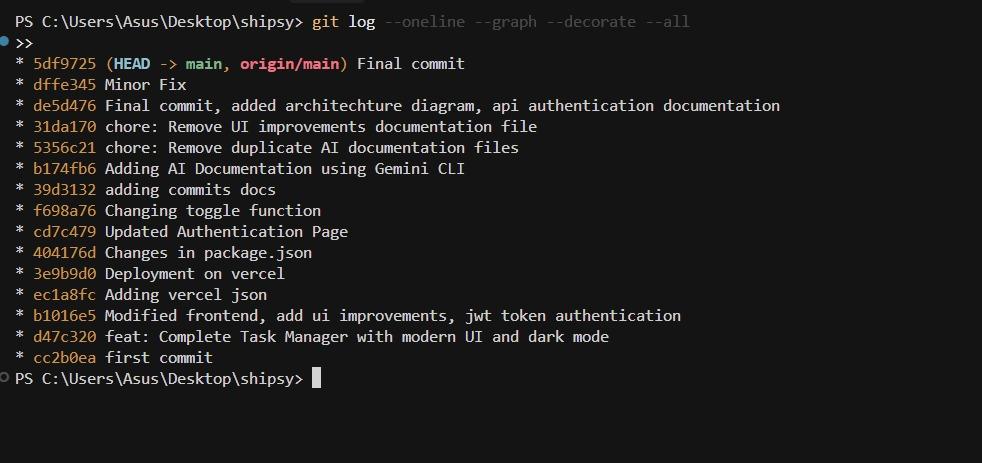

# Development History

## Hourly Commits During Development
Below is the distribution of commits by hour of the day.

| Hour | Number of Commits |
|------|--------------------|
| 2  | 00  |
| 4  | 01  |
| 3  | 02  |
| 1  | 14  |
| 1  | 16  |
| 1  | 17  |
| 3  | 20  |

> Data generated using:  
> `git log --date=format:'%H' | sort | uniq -c | sort -nr`

---

## Git Log Screenshot

